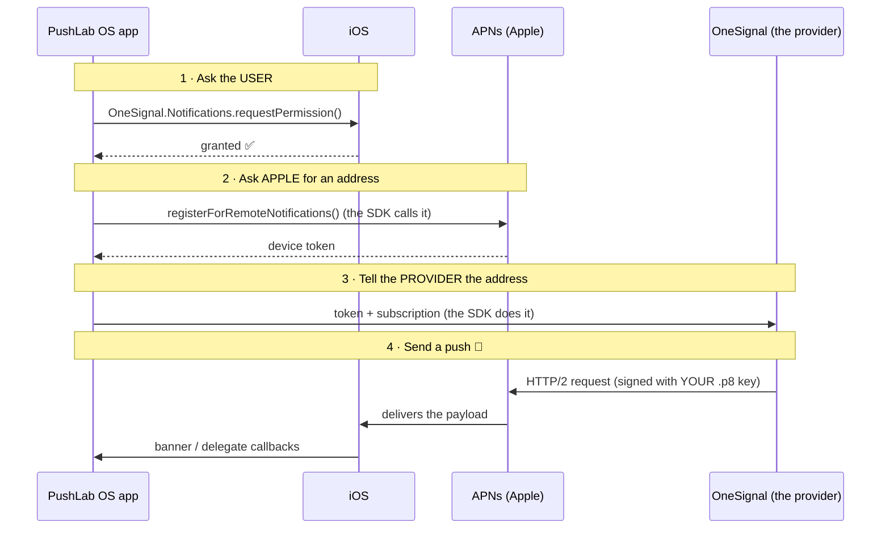

# PushLab OS 🔔

**A small, complete, end-to-end example of Apple Push Notifications** — built to be studied. Sending is powered by [OneSignal](https://onesignal.com), a hosted push provider with a free tier (unlimited mobile push sends), so there is no server to run.

The app demonstrates the three classic push flavors, and labels each one it receives so you can *see* the difference:

- 💬 **Basic** — title, body, sound, badge
- 🖼️ **Rich image** — a Notification Service Extension downloads and attaches an image (`mutable-content`)
- 🔘 **Action buttons** — buttons rendered from a notification category

---

## How remote push actually works

Four parties are involved. The one beginners forget about is **APNs** (Apple Push Notification service) — *all* pushes go through Apple's servers. The provider never talks to the phone directly:



Things worth memorizing:

- **All pushes go through APNs.** OneSignal doesn't talk to the phone either — it plays the "provider server" role, hosted.
- **The device token is an address, not a secret.** It identifies one app install on one device. It *can change* (reinstall, restore from backup) — the SDK re-checks it on every launch and keeps the subscription in sync.
- **OneSignal authenticates to APNs with *your* `.p8` key** — a private key you download from Apple once and upload to the dashboard. One key works for all your apps and never expires.
- **Development and production are two separate APNs worlds.** Apps run from Xcode get *development* (sandbox) tokens; TestFlight/App Store builds get *production* tokens. With `.p8` auth OneSignal handles both automatically.
- **The subscription ID is OneSignal's alias for "this token on this device".** Tokens change; OneSignal tracks that for you.

---

## Part 1 · One-time OneSignal setup (~5 minutes)

You need a `.p8` APNs key ([Certificates, Identifiers & Profiles → Keys](https://developer.apple.com/account/resources/authkeys/list) → **+** → check *Apple Push Notifications service* → download; note the **Key ID**).

1. Create a free account at [onesignal.com](https://onesignal.com/) (no credit card).
2. **New App/Website** → name it → choose **Apple iOS (APNs)**.
3. Authenticate with the **`.p8` Auth Key (recommended)**:
   - upload your `AuthKey_XXXXXXXXXX.p8` file
   - **Key ID** — the 10 characters in the filename
   - **Team ID** — from your [Apple membership page](https://developer.apple.com/account#MembershipDetailsCard)
   - **App Bundle ID** — this app's bundle identifier (see Xcode → target → Signing)
4. When asked for the SDK, pick **iOS (native)** — the code in this repo already does that part. You can skip/finish the wizard.
5. Grab your **App ID**: *Settings → Keys & IDs → OneSignal App ID*.

## Part 2 · Configure the app

Paste the App ID into [`OneSignalConfig.swift`](PushLab/OneSignalConfig.swift):

```swift
enum OneSignalConfig {
    static let appID = "12345678-abcd-1234-abcd-123456789012"
}
```

That's the only configuration — the App ID is public (it ships in the binary). The secret REST API key stays in the dashboard.

## Part 3 · Run the app

1. Open `PushLab.xcodeproj`, let Xcode resolve the OneSignal Swift package (first open takes a minute).
2. Run the **PushLab** scheme on an iOS simulator (Apple Silicon Macs receive **real APNs pushes** in the simulator) or a physical device.
3. Tap **Enable push notifications** → Allow.
4. The status flips to *Subscribed — ready for pushes*: the SDK asked Apple for the token and registered the subscription without any code of ours.

The device now appears in the dashboard under **Audience → Subscriptions**.

## Part 4 · Send pushes 🚀

### From the dashboard

**Messages → New Message → Push.** Type a title and message, then:

- 💬 **Basic** — just hit *Review and Send*.
- 🖼️ **Rich image** — put a URL (e.g. `https://picsum.photos/600/400`) in the **Image** field.
- 🔘 **Action buttons** — under *Advanced Settings*, add **Action Buttons** (each has an ID and a label; the ID is what the app sees).

Fastest loop for a single device: **Audience → Subscriptions → your device → Send Test Message**.

### From the REST API (the "your backend" story)

```bash
curl -X POST https://api.onesignal.com/notifications \
  -H "Authorization: Key YOUR_REST_API_KEY" \
  -H "Content-Type: application/json" \
  -d '{
    "app_id": "YOUR_ONESIGNAL_APP_ID",
    "included_segments": ["Total Subscriptions"],
    "headings": { "en": "Hello!" },
    "contents": { "en": "Sent through OneSignal REST API." },
    "ios_attachments": { "pic": "https://picsum.photos/600/400" },
    "buttons": [
      { "id": "accept", "text": "Accept ✅" },
      { "id": "decline", "text": "Decline" }
    ]
  }'
```

The REST API key lives in *Settings → Keys & IDs*. Unlike the App ID, this one **is** a secret.

---

## How the app works — reading guide

Read the files in this order; each is short and commented:

| # | File | What it teaches |
|---|---|---|
| 1 | [`OneSignalConfig.swift`](PushLab/OneSignalConfig.swift) | The one piece of configuration (and why it isn't a secret) |
| 2 | [`PushLabApp.swift`](PushLab/PushLabApp.swift) | Bridging an `AppDelegate` into SwiftUI |
| 3 | [`AppDelegate.swift`](PushLab/AppDelegate.swift) | `OneSignal.initialize(...)` at launch; where the raw device token arrives |
| 4 | [`NotificationManager.swift`](PushLab/NotificationManager.swift) | **The core.** Permission → subscription → delegate callbacks |
| 5 | [`ReceivedPush.swift`](PushLab/ReceivedPush.swift) | Deriving the push "flavor" from its payload |
| 6 | [`ContentView.swift`](PushLab/ContentView.swift) | The status card and the received-pushes list |
| 7 | [`NotificationService.swift`](NotificationService/NotificationService.swift) | The service extension that attaches the image |

Two delegate methods carry all the receiving logic — understand these and you understand iOS notifications:

- **`willPresent`** — fires only when a push arrives while the app is **in the foreground**. Return `[.banner, .sound, …]` to show it anyway (by default, foreground pushes are silent).
- **`didReceive`** — fires when the user **interacts**: taps the banner or one of its action buttons.

> ⚠️ The teaching point hidden in there: a push that arrives while the app is backgrounded **and is never
> tapped** is *never reported to the app*. That's why the in-app list can only show foreground deliveries
> and tapped notifications — and why the dashboard's sending stats are the reliable source for delivery counts.

## Notes & gotchas

- **Simulators receive real APNs pushes on Apple Silicon Macs** — but their connection to Apple is lazier than a real device's. If a push doesn't show while the app is closed, it was *stored* by Apple and will arrive as soon as the simulator's connection wakes (e.g. when you open the app). Real devices show it on the lock screen immediately — demo the closed-app case on a phone.
- **APNs stores only the most recent push** per app while a device is offline — send three to a sleeping device and only the last arrives.
- **OneSignal payloads carry a `custom` envelope** (`i` = notification ID, `att` = attachments, `a` = your additional data). Watch Xcode's console with the SDK's verbose logging to see it.
- **Confirmed Deliveries** and some analytics need a paid plan; sending pushes (all three flavors) is fully on the free tier.
- Optional extra (not set up here): an **App Group** (`group.<bundle-id>.onesignal`) lets the extension share state with the app for accurate badge counts.
